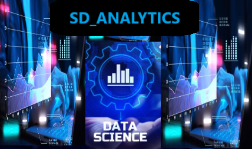

# <h1 align="center">_SD_ANALYTICS_</h1>

  

## Descripción

Este proyecto busca explorar redes neuronales, aplicando Pytorch

## Características

- Análisis Inicial del set de datos.
- Visualización Análisis Exploratorio.
- Preprocesamiento.
- Ingeniería de Datos.
- Predicciones y modelado de datos.

| Video sin aplicar Deep Learning                                                                     | 
| ----------------------------------------------------------------------------------------------- |
|  |

| Video con Deep Learning Aplicado                                                                     | 
| ----------------------------------------------------------------------------------------------- |
|  |

## Stack de tecnologías y herramientas

|  Librería/herramienta    |   Logo                                    | Descripción                                                                                                           |
|----------------------|-----------------------------------------|----------------------------------------------|
| **Pandas**   |         | Librería de Python para manipulación y análisis de datos.|
| **PyTorch** |  | Framework de aprendizaje profundo de código abierto que proporciona un apoyo flexible y potente para el desarrollo de modelos de aprendizaje automático. |
| **Matplotlib**|| Librería usada para la generación de gráficos en dos dimensiones.|
|**Seaborn**| | Librería de Python creada sobre matplotlib, usada para crear gráficos estadísticos.|
| **Jupyter**|| Software gratuito, estándares abiertos y servicios web para informática interactiva en todos los lenguajes de programación.|
| **Visual Studio Code**|| Editor de código fuente.|
| **Colaboratory con Python**|| Plataforma de Google basada en Jupyter Notebooks, junto con las librerías de Python para análisis de datos como Pandas y Matplotlib.|
| **Power Point**|| Microsoft PowerPoint (PPT) es un software de ofimática diseñado para realizar presentación de diapositivas.|
| **Python**|| Lenguaje de programación utilizado para análisis de datos y desarrollo de aplicaciones.|
| **GitHub**|| Plataforma de desarrollo colaborativo para proyectos de software.|
| **Google Drive**| | Servicio de alojamiento y sincronización de archivos.|
| **Streamlit** |  | Streamlit es una herramienta de código abierto diseñada para crear aplicaciones web interactivas y visualizaciones de datos de manera rápida y sencilla utilizando Python.|

## Colaboradores

|                         | Nombre   |   Rol                    | GitHub & LinkedIn                                                                                                                                                                                          |
| ----------------------------- | -------- | ---------------------- | ------------------------------------------------------------------------------------------------------------------------------------------------------------------------------------------------------- |
|  | Sergio Rivera Bustamante | Data Scientist |                           |
|                               |

